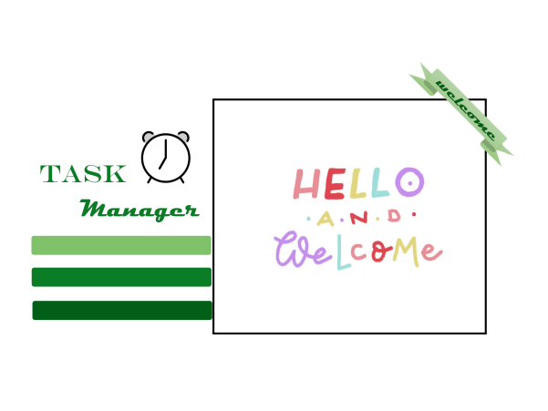
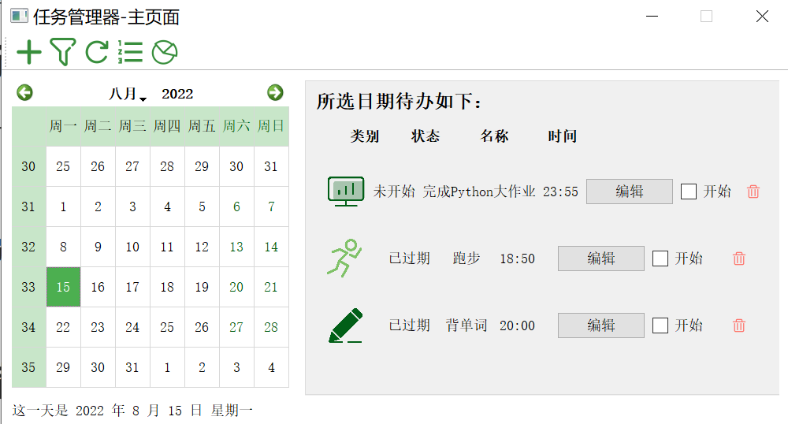
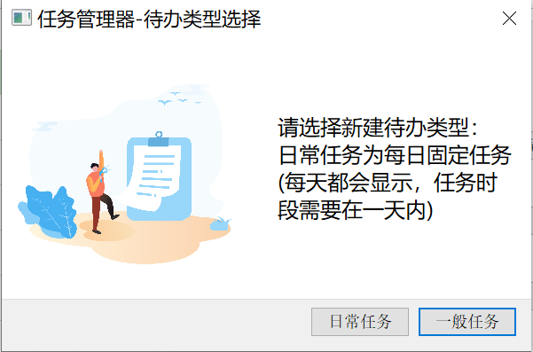
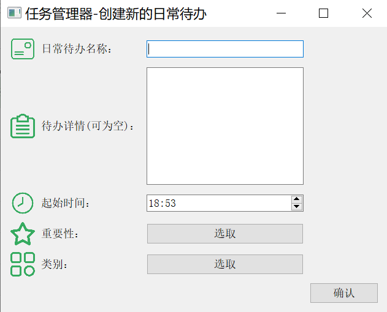
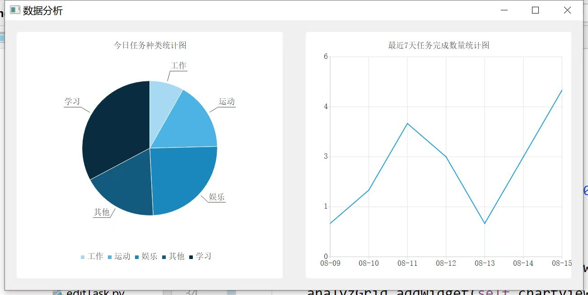

# 《暑期Python课》大作业实验报告

## 小组信息

组号 35

组员1 陆柏宏 20231198

组员2 陈凝香 20231185

组员3  匡莉  20373335

2022年8月

 

## 一、实验任务

所选题目：题目四

内容：任务调度程序 

要求： 设计一个应用程序以帮助用户计划日常的日程，合理记录任务以规划时间

## 二、已完成任务

- **基本实验要求**

  - 实验要求a：任务添加系统

    用户通过工具栏上的按钮以添加新的任务，设置任务的相应属性，如：标题，内容，截止时间，重要性，类别等

  - 实验要求b：显示每日任务

    当用户选中日历控件的特定日期时，当天任务将显示在主页面的右半部分

  - 实验要求c：任务完成确认

    任务控件中包含完成的勾选框，勾选后设置任务完成

  - 实验要求d：日历系统

    在程序主界面左侧增加日历控件

  - 实验要求e：任务状态区别。

    将任务状态分为四类：未开始，进行中，已完成，已过期

  - 实验要求f：任务调度

  - 实验要求g：用户登录系统

- **可选实验要求**

  - 可选要求a：待办事项系统可以根据时间进行过滤和显示任务。 
  - 可选要求b：任务类别划分。设置任务类别，包括工作，学习，娱乐，运动，其他共五项类别。
  - 可选要求c：支持日常任务。通过指定日常任务在每天出现的小时和分钟，使其每天自动出现在任务列表中
  -  可选要求d：加权任务调度。通过任务重要性和截止时间两个排序因素，自动规划未来的任务，安排任务的完成顺序，为用户呈现完成顺序列表
  -  可选任务e：支持数据回看，将用户数据以图表等形式显现

    

## 三、总体设计方案

我们将整个任务分为了前端和后端两部分，后端负责和数据库的交互、数据的保存，以及向前端提供数据。前端负责接受后端提供的数据并且将其显示在图形化界面中。

### 3.1 前端

前端主要设计了两个模块，一个是包含开机动画在内的用户登录系统界面，另外一个就是我们所设计的任务管理器的主界面，即`login`模块和`calendarFront`模块

#### 3.1.1 用户登陆系统

登录界面如下所示：

左侧为我们为该任务调度器自行设计的图标(印有"Task manager"字样)，右侧为输入部分，用户可以在此输入用户名以及密码。其中，用户名输入框和密码输入框中都有浅灰色的文字提示信息，告知关于输入用户名和密码的相关规范。在两个输入框下方，还有"记住密码"以及"显示欢迎动画"两个勾选框。如果勾选了某个勾选框，则在下一次登录该软件时，会按照所选择的行为显示(如：若勾选了"记住密码"，则下次登录的时候密码框自动输好了密码；若去掉了"显示欢迎动画"，则下次登录时不再显示3秒的欢迎动画)。

除了登录界面本身，"注册"的一系列操作也是用户登录系统的重点。

点击注册后，会依次显示"输入新用户名"，"输入新密码"，"重复输入密码"这三个弹窗。后两者有对设置的新密码进行约束。如果输入密码不符合规范(如：密码长度不在6-15位之间、密码保护数字、字母以外的特殊符号)，将会弹出相应的错误提示框，告知用户不符合规范之处。同样的，如果在第三次"重复输入密码"时，输入的密码与前面不同，也会弹出相应的错误提示框。

此外，可以看到，在登录界面的密码框右侧有个小方框。长按该方框则可以显示密码，移开鼠标则以"$\bullet$"显示密码字符。

#### 3.1.2 任务管理器主界面

由下图可知，主界面可被划分为三部分，即工具栏，日历模块，当日任务显示模块

- 工具栏

  在日历主界面中，左上方为工具栏：

  

  

  图标从左向右依次对应着 `添加任务` 、`筛选任务` 、`刷新任务`、`调度任务`，数据回看五项功能。

  - **添加任务**：依托于`addTask.py`文件，点击工具栏相应按钮后，触发`SelectTaskDialog`控件的显示，询问用户是添加日常任务还是一般任务

    

    点击不同的按钮触发各自相应的对话框，分别为继承自`AddTaskDialog`类的`AddDailyTaskDialog`类和`AddNormalTaskDialog`类。
    用户需要在页面上依次填写所创建待办的名称，详情，重要性以及类别，页面如下图所示

    

    日常任务和一般任务二者对话框的区别在于：用户在一般任务页面填入的是截止时间（包括年月日及小时分钟）而在日常任务页面只填入该任务在每日应开始的具体时刻。
    用户输入完任务的有关属性，点击对话框的确认按钮将触发`checkDate`函数，以判断所输入各数据的有效性，通过有效性检验后，系统根据属性创建`taskLabel`，自动调用`taskDisplay`，将任务显示在主界面右侧，详细设计见4.1

    

  - **筛选任务**：依托于`taskFliter.py`文件，点击工具栏相应按钮后，触发控件的显示，询问用户筛选的起始日期与结束日期，再传入后端以读取用户数据进行显示

    由于筛选基于日期，而日常任务在每天均会出现，因此此处得到一般任务列表

    

  - **刷新任务**：我们将任务分为了未开始，进行中，已完成和已过期四种状态。我们认为，任务的开始和完成与否是由用户决定的，所以只有**已过期**这个状态是由系统决定。用户没有操作的界面是静态的，但随时间流逝，一些未开始的任务可能已经超过了截止时间，变为已过期的状态，所以我们设计`refreshAndDisplay`函数，传入当前时刻到后端，调用后端函数自动判断任务是否过期，前端再重新读入更改后的数据在页面进行显示

  - **调度任务**：此处我们只调度当日任务，按照重要性和时间的加权排序，以重要性为第一关键字，时间为第二关键字，得到排序完毕的任务列表，再在前端调用函数进行显示

  - **数据回看**：以用户当日待办类别的不同绘制饼图，以用户最近七日任务完成数量绘制折线图，以清晰直观的展现用户的任务情况

    

    

- 日历模块

  使用了` PyQt5.QtWidgets` 的`QCalendarWidget`控件，可以得到用户所选中的日期，并在底部增加标签显示该日期的详细情况，使页面布局简洁大方

- 任务显示

  详细设计见4.1

  

### 3.2 后端

后端采用 面向对象方法设计，主要分为以下两个部分

* `Method`模块，是用来进行用户注册和登录的模块

* `Module`模块，存储数据的类，由以下几个类组成

  * User类

    每个登录系统的用户对应一个User对象。前端可以调用User对象的方法获取任务信息。

  * Calender类

    Calender类表示一个月的日历，组织着Task。Calender存储某个月的待办信息，使用了Python的字典将日期和当天的任务对应起来。

    Calender对象对于前端不可见的，由后端组织，这就保证了接口的简洁并且降低了前后端的耦合性。

  * Task类

    Task类用来表示待办，是这个项目中最底层的类。Task类中存储着一项待办的基本信息，其属性有待办的标题、内容、时间、类别以及当前状态等。Task类还可以将任务对象和json相互转化的功能，用于实现任务的储存和读取。

  * DailyTask(Task)类

    DailyTask是Task的子类，用来表示日常任务，除了一般任务的属性之外，DailyTask还保存了之前已经完成这个任务的日期。这部分的具体介绍见5.1。
    
    

## 四、创新之处

### 4.1 任务的显示

#### 4.1.1 任务标签的设计

自左向右分别是图标，待办状态，待办名称，待办时间，编辑按钮，状态切换按钮以及删除按钮

- 图标：代表了任务的类别与重要性，当任务越重要，图标颜色越深，而图标的样式与待办类别相联系
- 编辑按钮：用户点击后跳出任务编辑框，与任务添加框较为类似，不同在于编辑框起始即显示任务之前的各类属性
- 状态切换按钮：为布局更美观以及给用户更好的体验感，合并了开始和结束按钮，当用户开始未完成的任务后，勾选框文字变为`完成`，且勾选框取消勾选

为了让用户便于分辨任务状态，对于`已完成`的任务将标签文字颜色设置为灰色，并增加删除线

#### 4.1.2 主界面任务布局

考虑到界面大小和用户的实际需求，在主界面右侧任务显示区增加了竖直滚动条，因此可现实的任务个数不限

当所选中的日期没有任务时，显示提示信息

### 4.2 数据的存储和更新

#### 4.2.1 数据的储存

后端使用数据库`TinyDb`存储数据。`TinyDb`是一个基于文本的数据库，将要存储的的数据解析为python中的字典、列表或者其他基本数据类型就可以作为TinyDb数据库的一条记录。被存储的数据是json格式，每个用户对应一个json文件。

用户登录的时候，为了节约资源，仅仅创建数据库对象而不对其中的数据进行加载和处理，当用户需要获取某个月的数据的时候再创建对应的Calender对象，Calender对象在初始化的时候再从数据库中读入当月Task对应的数据，由Task类解析为Task对象，存入Calender中。这种“需要时再加载”的处理方法使得我们的程序不必每次启动的时候加载所有Task，长时间使用也没问题。

在读取数据之后，我们会将数据存储在Task对象中，用Calender组织起来，这种处理相当于数据的一个缓存，不必每次都从文件中读取。

#### 4.2.2 数据的更新

在程序运行过程中，数据库与进程内存中的数据同步更新，即在修改Task对象的时候同步修改它对应的数据项，这样相比于在程序结束时统一存入文件可以有效防止程序被意外终止导致的信息丢失。

### 4.3 任务状态的更新

这里主要涉及到的问题是在什么时候应该将一个任务的状态设置为“已经过期”。我们的做法是每次前端从后端获取某一天的Task列表的时候，我们会扫描一边今天的Task，如果当前时间已经超过了Task的截止时间，则将其状态设置为已过期。

对于DailyTask，由于前面提到，DailyTask对象表示“今天”的这个日常任务的状态，它的时间对应的年月日都是今天的年月日，因此和普通任务的判断方法一样。

### 4.4 异常情况的判断

我们设置了`showWarning`类，当用户对程序的交互出现异常时，便会跳出相应问题的警告窗口，让用户重新进行相关设置。

如待办名称不能为空，设置的截止日期不能早于当前时间，已过期的任务不能开始，尚未开始的任务无法完成等等

## 五、实验总结

实验中碰到的难点以及我们的解决思路：

### 5.1 日常任务的处理

#### 5.1.1 日常任务的储存

对于日常任务，因为日常任务每天都有并且内容是一样的，每天都存一份比较浪费资源，因此我们认为没有必要多次保存，只需要在User对象中存一份DailyTask，其状态表示当天的日常任务状态（进行中、未开始、已完成、已过期）。

一般来说，日常任务只需要存储开始的时间（时分秒），不需要储存年月日，但是为了和一般任务保持统一，我们将DailyTask属性时间的年月日设置为当天的年月日，这种处理方式有两个作用，一是用于决定dailyTask是否应该被重新设置为未开始（每天dailyTask都会重置为未开始），另一个用途是用于决定一条任务什么时候应该被更新为过期状态。这种统一简化了程序。

#### 5.1.2 任务状态的区分

对于已经完成的日常任务，我们会在DailyTask对象中存下完成此任务的日期，代表“某日已完成这个DailyTask”。这样是为了获取今天之前的DailyTask的完成情况。如果想获取某一天的日常任务的状态，调用`getState`方法。如果这个日期在今天之前，查找此任务的已完成日期列表中有没有这一天，如果有，则认为这任务在那一天已完成；如果没有，则认为其已过期。如果这个日期是今天，则直接返回DailyTask对象的状态。如果这个日期在今天之后，则认为这个任务未开始。这里使用了面向对象中的多态，Task对象的`getTask`方法直接返回对象的`State` 属性，而`DailyTask` 对象则需要根据日期判断。

另一个问题是**如何在每天开始的时候将日常任务的状态切换为“未开始”**。我们的处理方法是记录下上一次创建这个DailyTask的日期，如果今天的日期和上一次存的日期不同的话，说明上一次使用DailyTask已经不是今天了，需要将DailyTask的状态重置为未开始状态。反之说明上一次使用DailyTask就是在今天，不改变其状态。

在创建日常任务之前的日期不显示该日常任务，这样处理比较符合用户的直觉。我们的处理方法是记录下任务的创建日期，只有获取创建日期之后的待办才会加入这个DailyTask。

#### 5.1.3 任务的多态与继承

在我们的实验中，任务被分为了一般任务和日常任务，二者属性重叠部分很高，都拥有属性：名称，详情，重要性以及类别。区别在于从用户角度而言，他们更希望管理器提供日常任务的提醒（如打卡），即任务的开始时间；而对于一般任务而言，用户希望管理器更像一个备忘录（如计组作业的截止），提醒任务的结束时间。且前者只应包含时间（时分秒），后者应包括日期和时间。

因此在前端的页面设计方面，两种任务的时间编辑器存在差异，但二者其他方面相似性很高，此时如果写各自独立的`AddDailyTaskDialog`类和`AddNormalTaskDialog`类，代码显得冗余，对某相同部分做出更改时，需要同时改两个类，降低了代码的健壮性，以面向对象的封装，继承，多态的思想来看，基于此抽象出了`AddTaskDialog`类。在后续代码迭代过程中，发现需要增加编辑任务的窗口，此时就只需在`AddTaskDialog`类上做出细小改动即可。

## 六、课程学习总结

### 6.1 课程收获

在这门课程的学习中，我对python的使用更加熟练。在平时作业中我初步接触了一些算法（尤其是动态规划），练习有助于掌握。由于这门课是全英文授课，在平时授课中，我不仅英语水平得到了一些提升，还认识了一些术语的英文表达，这些是在其他课上学不到的。在大作业的完成过程中，我们学习了使用PyQt5编写图形化界面的基本方法，这部分知识应该会很实用。

### 6.2 难点分析

平时作业难点主要在于程序设计和算法知识，但是题目都比较经典，我从中学到了不少方法。大作业的难点主要在于PyQt5的使用，由于我们以前没有接触过GUI，所以这方面需要查阅较多资料。

### 6.3 教师授课评价

老师上课讲述清晰有趣，并且有一定的拓展内容。

### 6.4 助教评价

助教认真负责，在群里会及时回答我们提出的问题。

### 6.5 当前课程教授内容评价与课程进一步改进建议

感觉平时课后作业和授课内容联系不大，可以适当调整课后作业，多加入一些和授课内容相关的东西。

## 七、主要参考资料

PyQt5 教程：[Hello World - PyQt 中文教程 (gitbook.io)](https://maicss.gitbook.io/pyqt-chinese-tutoral/pyqt5/hello_world)

Qt5 reference： [Qt 5.15](https://doc.qt.io/qt-5/)
